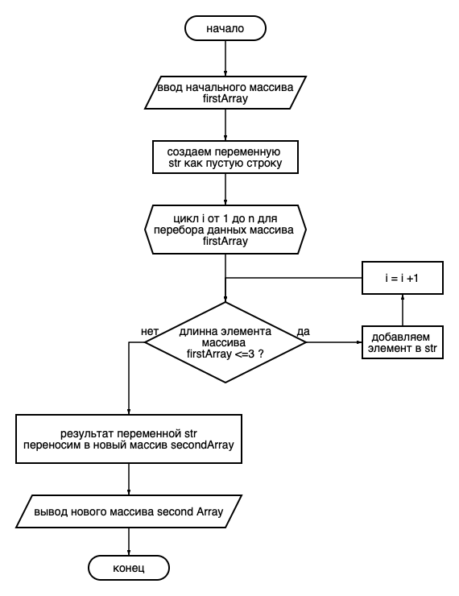

# Итоговая проверочная работа по прохождению курса "Выбор специализации"
***Студент - Тюляев Олег***

## Для выполнения проверочной работы необходимо:

1. Создать репозиторий GitHub;
2. Нарисовать блок схему алгоритма;
3. Создать в репозитории файл README.md
4. Написать программу, решающую задачу
5. Использовать контроль версий в работе над этим проектом

### Задача для решения
Написать программу, которая из имеющегося массива строк формирует массив из строк, длинна которых меньше либо равна 3 символа. Первоначальный массив можно ввести с клавиатуры, либо задать на старте выполнения алгоритма. 
При решении не рекомендуется пользоваться коллекциями, лучше обойтись исключительно массивами.

**Работа программы выглядит так**
["hello", "2", "word", ":-)"] -> ["2", ":-)"]
["1234", "1567", "-2", "computer science"] -> ["-2"]
["Russia", "Denmark", "Kazan", ""] -> []

## Алгоритм решения

 

## Код программы

using System;
using static System.Console;

Clear();
string[] firstArray = { "hello", "2", "word", ":-)", "123", "156", "computer scence", "Russia", "Denmark", "Kaz" };
string str = string.Empty;

for (int i = 0; i < firstArray.Length - 1; i++)
{
    if (firstArray[i].Length <= 3) str = str + firstArray[i] + ",";
}
if (firstArray[firstArray.Length - 1].Length <= 3) str = str + firstArray[firstArray.Length - 1];

string[] secondArr = str.Split(",");

Console.Write("[");
for (int i = 0; i < secondArr.Length - 1; i++)
{
    Console.Write(secondArr[i] + ", ");
}
Console.WriteLine(secondArr[secondArr.Length - 1] + "]");
